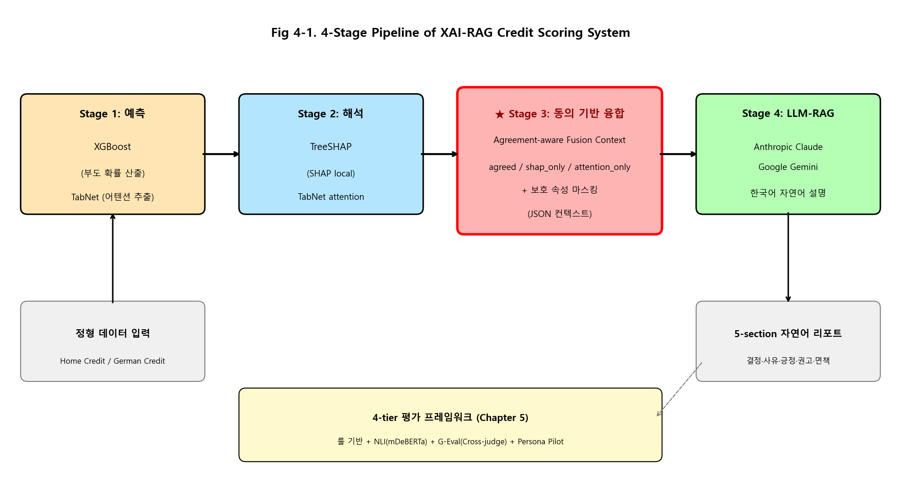

# 제 4 장. 연구 방법론

## 4.1 시스템 전체 구조

본 연구가 제안하는 시스템은 정형 데이터로부터 부도 확률 예측과 자연어 설명 리포트를 동시에 생성하는 4단계 파이프라인 구조를 갖는다(그림 4-1). 4단계는 다음과 같다.



1. **예측 단계**: XGBoost가 메인 예측 모델로 부도 확률 p (0~1 범위)을 산출한다. TabNet은 보조 모델로서 별도의 부도 확률 예측을 수행하면서, 동시에 인스턴스 수준의 어텐션 마스크 M_att 를 추출한다.

2. **해석 단계**: XGBoost의 예측에 대해 TreeSHAP [15]을 적용하여 인스턴스별 변수 SHAP 값 phi (n차원 실수 벡터)을 산출하고, TabNet의 어텐션 마스크 M_att (값 범위 [0, 1]의 n차원 벡터)와 비교 가능한 형태로 정렬한다.

3. **융합 컨텍스트 구성 단계**: SHAP 상위 k_shap 변수와 어텐션 상위 k_att 변수를 *동의 그룹(agreed)*, *SHAP 단독(shap_only)*, *어텐션 단독(attention_only)* 의 세 그룹으로 분류한 JSON 컨텍스트를 생성한다. 이 단계에서 보호 속성에 해당하는 변수는 명시적으로 마스킹된다.

4. **자연어 생성 단계**: 융합 컨텍스트를 LLM(Anthropic Claude 또는 Google Gemini)에 입력하여 한국어 자연어 설명 리포트를 생성한다. 생성 시점에는 hard constraint를 통해 컨텍스트 외부 정보의 인용을 금지하고, 5-section 구조의 출력 형식을 강제한다.

이 4단계 구조는 *예측의 정확성*, *해석의 보완성*, *컨텍스트의 fact-grounding*, *자연어의 사용자 친화성* 이라는 네 가지 요건을 단계별로 분리하여 각자 최적화한다는 설계 철학을 반영한다.

## 4.2 예측 모델 학습

### 4.2.1 XGBoost (메인 예측 모델)

XGBoost는 그래디언트 부스팅 트리의 정규화·병렬 학습 구현으로, 본 연구의 메인 예측 모델로 활용된다. 본 연구는 다음 hyperparameter로 학습한다: 트리 개수 500, 최대 깊이 6, 학습률 0.05, 부분 표본률(subsample) 0.9, 컬럼 부분 표본률(colsample_bytree) 0.9, 클래스 불균형 보정을 위한 scale_pos_weight = (음성 표본 수) / (양성 표본 수). 평가 지표는 AUC를 사용하며 30 라운드의 조기 종료(early stopping)를 적용하여 검증 셋에서의 과적합을 방지한다. tree_method='hist' 옵션을 적용하여 대규모 데이터에서의 학습 속도를 향상시킨다.

UCI German Credit과 같은 소표본 데이터셋의 경우 트리 개수를 300, 최대 깊이를 4로 줄여 과적합을 방지한다. 본 연구의 모든 무작위성은 SEED=42로 고정하여 재현 가능성을 확보한다.

### 4.2.2 TabNet (보조 + 어텐션 추출용)

TabNet은 보조 예측 모델 역할과 함께 인스턴스 수준 어텐션 마스크를 제공하는 핵심 역할을 수행한다. 본 연구는 Optuna 라이브러리를 활용한 hyperparameter 탐색을 통해 다음과 같은 최적 구성을 도출하였다(Home Credit 기준): n_d = 16, n_a = 16, n_steps = 3, gamma = 1.156, lambda_sparse = 1.31 × 10⁻⁵, 학습률 0.0367, mask type entmax. 옵티마이저는 AdamW(weight decay 10⁻⁵), 학습률 스케줄러는 StepLR(gamma = 0.7, step size 10)을 사용한다.

학습 시 batch_size=1024, virtual_batch_size=128(Home Credit), max_epochs=60, patience=12로 설정하며, GPU(NVIDIA GTX 1660 Ti, CUDA 12.1)에서 학습한다. UCI German Credit의 경우 데이터 규모에 맞춰 n_d = n_a = 8, n_steps = 3, batch_size=128, virtual_batch_size=32로 축소한다.

### 4.2.3 5-fold Stratified CV 평가

단일 train/test 분할에 의한 학습 결과의 변동성을 줄이기 위해 본 연구는 5-fold stratified cross-validation을 수행한다. 학습/검증 셋(전체 80%)을 5개 fold로 분할하고, 각 fold에서 4개를 학습에 1개를 검증에 사용한다. 매 fold마다 모델을 새로 학습한 후, 별도로 분리해 둔 테스트 셋(20%)에 대해 평가하여 mean ± std를 보고한다.

검증 셋에서는 Youden's J 통계량(J = TPR − FPR을 최대화하는 임계값)으로 분류 임계값을 결정하고, 동일 임계값을 테스트 셋에 적용한다. 이러한 절차는 임계값 결정에 테스트 셋 정보가 누출되는 것을 방지한다.

평가 지표는 AUROC, AUPRC, KS 통계량(KS = max|TPR − FPR|), F1 점수, 정밀도(Precision), 재현율(Recall)의 6개를 보고한다. 본 연구는 신용평가의 클래스 불균형 특성상 AUROC뿐만 아니라 AUPRC와 KS를 함께 강조한다.

## 4.3 모델 해석

### 4.3.1 SHAP local (XGBoost)

학습된 XGBoost 모델에 대해 인스턴스 수준의 SHAP 값을 산출한다. 본 연구는 SHAP 0.49 라이브러리와 XGBoost 3.x의 base_score 파싱 호환성 문제를 회피하기 위해, XGBoost의 native pred_contribs=True API를 직접 활용하는 사용자 정의 explainer(_XgbNativeExplainer)를 구현하였다. 이 우회 구현은 SHAP의 표준 인터페이스(expected_value, shap_values)를 동일하게 제공하면서, 두 라이브러리 버전 간의 간섭을 회피한다.

테스트 셋의 무작위 추출 100명에 대한 SHAP 값을 산출하고, 각 인스턴스별로 절대값 기준 상위 5개 변수(k_shap = 5)와 그 부호(sign_for_default ∈ {+, −})를 추출한다. + 부호는 해당 변수의 현재 값이 부도 가능성을 *높이는* 방향으로 작용함을, − 부호는 *낮추는* 방향으로 작용함을 의미한다.

전역 해석 차원에서는 테스트 셋 5,000명에 대한 평균 절대 SHAP 값(mean(|SHAP|))을 산출하여 변수 중요도 랭킹을 도출한다. Home Credit 데이터셋에서 이 랭킹의 상위는 외부 신용평가 점수 3개(EXT_SOURCE_2, EXT_SOURCE_3, EXT_SOURCE_1)가 차지하며, German Credit에서는 체크 계좌 상태(checking_status_no_checking), 대출 기간(duration), 신용 이력(credit_history_critical/other_existing_credit) 등이 상위에 분포한다.

### 4.3.2 TabNet 어텐션 (instance-level)

학습된 TabNet 모델의 clf.explain(X) API를 호출하여 인스턴스별 어텐션 마스크 M_explain (n × d 차원, 값 범위 [0, 1])를 추출한다. 이는 TabNet의 모든 step에서 산출된 어텐션 마스크의 합산이며, 본 연구에서는 각 인스턴스에 대해 어텐션 값이 큰 상위 5개 변수(k_att = 5)를 추출한다.

SHAP과 달리 어텐션 마스크는 모두 비음수(non-negative) 값으로 구성되며, sparsemax 활성화 함수의 특성상 sparse한 분포를 보인다. 즉 모든 변수에 0이 아닌 값을 부여하는 SHAP과 달리, TabNet 어텐션은 일부 변수에만 0이 아닌 값을 부여한다. 이러한 차이는 두 해석 모델이 *다른 관점* 을 제공함을 시사한다.

### 4.3.3 SHAP × 어텐션 일관성 분석

두 해석 모델의 일관성을 정량 평가하기 위해 변수별 평균 |SHAP|과 평균 어텐션의 Spearman 순위 상관계수(ρ)와 Top-K 중복률(overlap)을 산출한다. Spearman 상관계수는 두 변수의 순위 일관성을 측정하며, Top-K 중복률은 SHAP 상위 K개와 어텐션 상위 K개 변수 집합의 교집합 비율을 측정한다.

Home Credit 데이터셋의 분석 결과 전체 변수에 대한 Spearman ρ = 0.117, Top-50 중복률은 약 0.32 수준으로 *약한 양의 상관과 중간 정도의 중복* 이 관찰된다. 같은 분석을 UCI German Credit에 적용한 결과 ρ = 0.114, Top-10 중복률 0.40, Top-20 중복률 0.35로 거의 동일한 패턴이 확인된다. 이는 *부분적 일관 + 부분적 상보* 의 패턴이 신용평가 도메인의 일반 패턴임을 시사하며, 본 연구가 두 해석 모델을 융합하는 정당성을 정량적으로 뒷받침한다.

## 4.4 Agreement-aware Fusion Context (★ 본 연구의 핵심 기여)

본 연구의 가장 중요한 기여는 SHAP과 TabNet 어텐션을 인스턴스 수준에서 융합한 *동의 기반(agreement-aware)* 컨텍스트의 신규 설계이다. 본 절은 이 컨텍스트의 구성 원리와 JSON 형식을 상세히 기술한다.

### 4.4.1 3-그룹 분류

각 인스턴스 x 에 대해 SHAP 상위 k 개 변수 집합을 S_shap(x), 어텐션 상위 k 개 변수 집합을 S_att(x) 라 하면, 이 두 집합은 다음 세 그룹으로 분해된다.

- **agreed**: S_shap(x) ∩ S_att(x) (두 집합의 교집합)
- **shap_only**: S_shap(x) − S_att(x) (SHAP에만 속하는 변수)
- **attention_only**: S_att(x) − S_shap(x) (어텐션에만 속하는 변수)

*agreed* 그룹은 두 해석 모델이 모두 주목한 변수들로, 본 연구는 이를 *가장 신뢰할 수 있는 강한 신호* 로 정의한다. *shap_only* 그룹은 SHAP의 부호 정보를 갖지만 어텐션이 주목하지 않은 변수들로 *보완 신호*, *attention_only* 그룹은 부호 정보 없이 어텐션이 주목한 변수들로 *추가 참고 정보* 로 분류된다.

Home Credit 데이터셋의 100개 인스턴스에 대한 분석 결과 평균 *agreed* 그룹 크기는 2.12개로 (k=5 기준 약 42%의 동의율), n_agreed 분포는 0~3개 범위에서 변동하였으며 4개 이상의 동의는 발생하지 않았다. 이는 두 해석 모델이 부분적으로만 동의함을 정량적으로 보여준다.

### 4.4.2 보호 속성 마스킹

LLM 기반 자연어 설명에서 차주에게 노출되는 텍스트에 보호 속성이 직접 언급되지 않도록, 본 연구는 컨텍스트 구성 단계에서 다음 변수들을 명시적으로 마스킹한다.

- Home Credit: CODE_GENDER, DAYS_BIRTH(연령으로 변환되는 변수)
- UCI German Credit: age, personal_status_*(성별 결합 변수), GENDER_*(분해된 성별 변수), foreign_worker_*

이 변수들이 SHAP 또는 어텐션 상위에 포함되어 있는 경우, 컨텍스트의 모든 그룹에서 제거하여 LLM이 이 변수들을 인용할 가능성을 원천 차단한다. 마스킹된 변수 목록은 컨텍스트 메타데이터에 masked_sensitive_features 필드로 포함되어, 후속 평가에서 마스킹의 정상 작동을 검증할 수 있다.

### 4.4.3 JSON 컨텍스트 구조

융합 컨텍스트는 다음과 같은 JSON 구조로 LLM에 전달된다.

```json
{
  "sample_idx": 12345,
  "decision": "REJECT",
  "default_probability": 0.7823,
  "threshold": 0.4762,
  "agreed_drivers": [
    {
      "feature": "외부 신용평가 점수 3",
      "feature_raw": "EXT_SOURCE_3",
      "value": "0.10",
      "rank": 1,
      "group": "agreed",
      "shap": 0.95,
      "sign_for_default": "+",
      "attention": 0.234
    }
  ],
  "shap_only_drivers": [...],
  "attention_only_drivers": [...],
  "n_agreed": 1,
  "n_shap_only": 4,
  "n_attention_only": 4,
  "model_predict": "XGBoost",
  "model_explain": ["SHAP_xgb_local", "TabNet_attention_local"],
  "explanation_policy": "fact_only_with_agreement_labels",
  "masked_sensitive_features": ["CODE_GENDER", "DAYS_BIRTH"]
}
```

각 driver entry는 변수의 한국어 라벨(`feature`)과 원시 컬럼명(`feature_raw`), 사람-친화 형식의 값(`value`), 그룹 분류(`group`), SHAP 값과 부호(`shap`, `sign_for_default`), 어텐션 점수(`attention`)를 포함한다. *attention_only* 그룹의 entry에는 `shap`과 `sign_for_default` 필드가 누락되며, 이는 LLM이 부호 정보를 추정하지 않도록 명시적으로 알리는 역할을 한다.

## 4.5 LLM-RAG 자연어 설명 생성

### 4.5.1 4-mode 컨텍스트 비교

본 연구는 융합 컨텍스트의 차별성을 입증하기 위해 동일한 30개 인스턴스에 대해 4가지 컨텍스트 모드를 적용하여 비교한다.

- **no_shap**: 원시 변수와 값만 포함, SHAP/어텐션 정보 없음. 자유 추론 baseline.
- **generic_rag**: 원시 변수 + 7개의 일반 도메인 지식 chunks + hard constraint. SHAP은 없으나 도메인 지식이 RAG 형태로 제공된다.
- **shaponly**: SHAP 상위 5개 변수와 부호 정보 + hard constraint. TabNet 어텐션 없음.
- **fusion**: 본 연구의 동의 기반 융합 컨텍스트(4.4절). SHAP + TabNet 어텐션 모두 활용.

이 4-mode 비교는 *환각 차단의 충분조건* 과 *fact-grounded 충실성의 차별 조건* 을 분리하여 검증하기 위해 설계되었다. 즉, hard constraint만으로 환각이 차단된다면, 그 차단된 baseline 위에서 SHAP 정보 추가 여부와 TabNet 어텐션 추가 여부가 어떤 추가적 가치를 제공하는지를 정량적으로 분리할 수 있다.

### 4.5.2 Hard Constraints

모든 모드의 LLM 프롬프트는 다음 5가지 hard constraint를 명시적으로 포함한다.

1. 컨텍스트에 명시된 변수와 값만 인용한다. 컨텍스트에 없는 변수, 수치, 전화번호, 상품명을 절대 생성하지 않는다.
2. 의료·법률 자문, 단정적 미래 예측, 특정 금융 상품 추천을 하지 않는다.
3. 민감 변수(성별·연령·인종·종교·출신 지역)를 직접 언급하지 않는다.
4. 거절 사유는 컨텍스트의 부도 가능성을 높이는 변수에서, 긍정 요인은 부도 가능성을 낮추는 변수에서만 선택한다.
5. SHAP 부호를 정확히 반영한다 (양수=부도 가능성↑, 음수=부도 가능성↓).

### 4.5.3 LLM 모델 선택

본 연구는 단일 LLM에 대한 결과 의존성을 줄이기 위해 두 모델을 동시 활용한다.

- **Anthropic Claude Sonnet 4.5** (claude-sonnet-4-5): 응답 안정성이 높고 hard constraint 준수율이 뛰어난 것으로 알려진 모델. 본 연구의 G-Eval judge로도 활용된다.
- **Google Gemini 2.5 Flash** (gemini-2.5-flash): 응답 길이가 비교적 길고 풍부한 표현을 생성하는 모델. 본 연구에서는 Anthropic의 cross-LLM 비교 대상이 된다.

두 모델 모두 paid tier API를 활용하여 안정적인 응답 품질과 시간을 확보한다. 본 연구는 자유 추론 모드(no_shap)와 RAG 모드(generic_rag, shaponly, fusion) 모두에서 동일한 두 LLM을 사용함으로써, 모델 의존성을 통제하면서 모드 간 차이를 분리한다.

### 4.5.4 출력 형식 (5-section)

생성된 자연어 설명 리포트는 다음 5개 섹션의 순서로 구성된다.

1. **결정 요약** (1줄): 최종 결정(REJECT/APPROVE)과 부도 확률, 임계값.
2. **주요 거절 사유** (REJECT일 때만, 최대 3개): 부도 가능성을 높인 주요 변수와 그 값.
3. **긍정적으로 평가된 요인** (최대 3개): 부도 가능성을 낮춘 변수와 그 값.
4. **개선 권고** (1~3개): 향후 신용도 개선을 위한 일반 안내.
5. **면책 고지** (1~2줄): 본 평가가 모델 기반 참고 정보이며 단정적 미래 예측이 아니라는 안내.

이 5-section 구조는 차주가 결과를 단계별로 이해할 수 있도록 설계된 것으로, 결정 → 사유 → 긍정 요인 → 개선 → 면책의 순서가 정보 흐름의 자연스러운 경로를 따른다.

## 4.6 공정성-aware 학습

### 4.6.1 Reweighing (Kamiran-Calders) — 사전 처리

본 연구는 사전 처리 공정성 보정 기법으로 Reweighing [9]을 적용한다. 이 기법은 학습 데이터의 각 인스턴스에 다음 가중치를 재할당한다.

> **수식 4-1**: w(x) = [P(s = s_x) × P(y = y_x)] / P(s = s_x, y = y_x)

여기서 s 는 보호 속성, y 는 결과 변수, s_x 와 y_x 는 인스턴스 x 의 보호 속성과 결과 라벨이다. 이 가중치는 *통계적 독립성* 의 관점에서 보호 속성과 결과 변수가 독립이었을 경우의 기대값과 실제 관측치의 비율을 계산한 것이다. 학습 알고리즘은 이 가중치를 손실 함수의 sample weight으로 직접 활용한다.

본 연구는 이를 두 보호 속성(GENDER, AGE)에 대해 두 데이터셋(baseline, aux)에 적용하여 총 4가지 조합 모두에서의 효과를 정량 평가한다. 평가 결과는 6장에서 상세히 보고한다.

### 4.6.2 Fairlearn ExpGrad — 도중 처리

비교 baseline으로 Microsoft Fairlearn의 Exponentiated Gradient(ExpGrad) 알고리즘 [21]을 적용한다. 이는 라그랑주 형태의 공정성 제약(Demographic Parity 또는 Equal Opportunity)을 학습 알고리즘에 직접 통합하는 도중 처리 기법으로, 보호 속성 그룹 간의 결과 분포 편차를 명시적으로 최소화한다.

본 연구는 두 가지 제약 형태(DP, EO)를 모두 적용하여 비교한다. 사전 결과로는 ExpGrad+DP는 AUROC 손실이 큰 반면 4/5 규칙은 통과하지 못하는 경우가 있고, ExpGrad+EO는 4/5 규칙(이는 DP 기반)을 직접 보장하지 않는 본질적 한계가 관찰되었다. 자세한 비교는 6장에서 보고한다.

이상의 방법론을 바탕으로 다음 제5장에서는 본 연구의 평가 프레임워크를, 제6장에서는 모든 실험 결과를 통합 보고한다.
