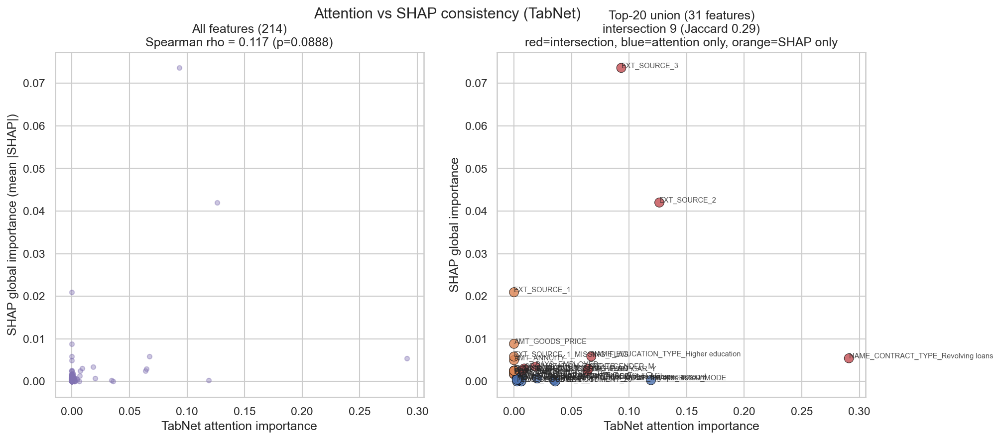
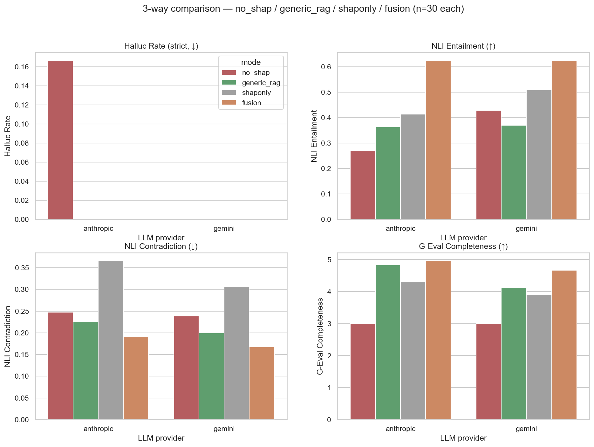
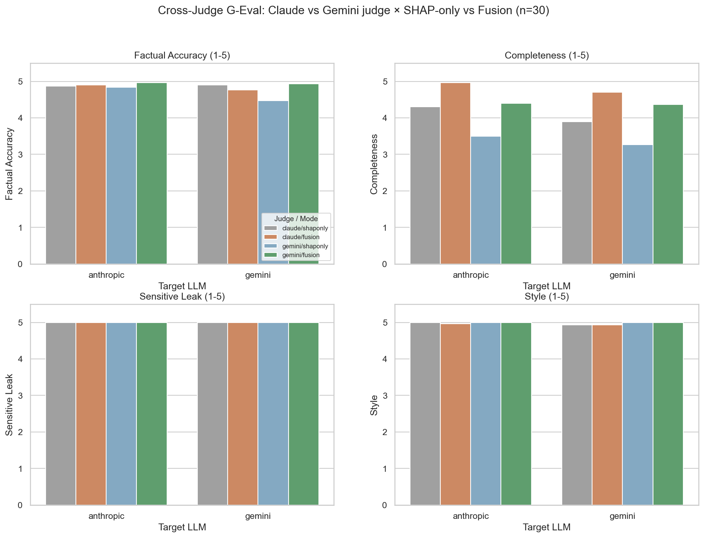
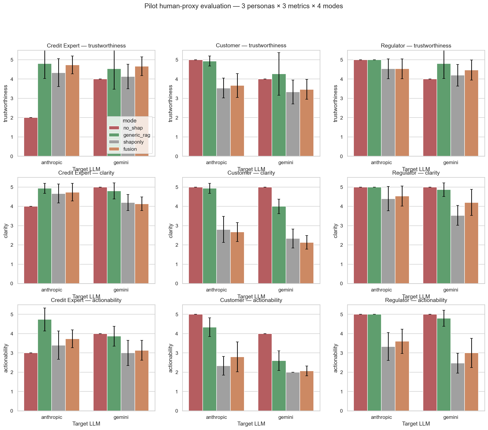
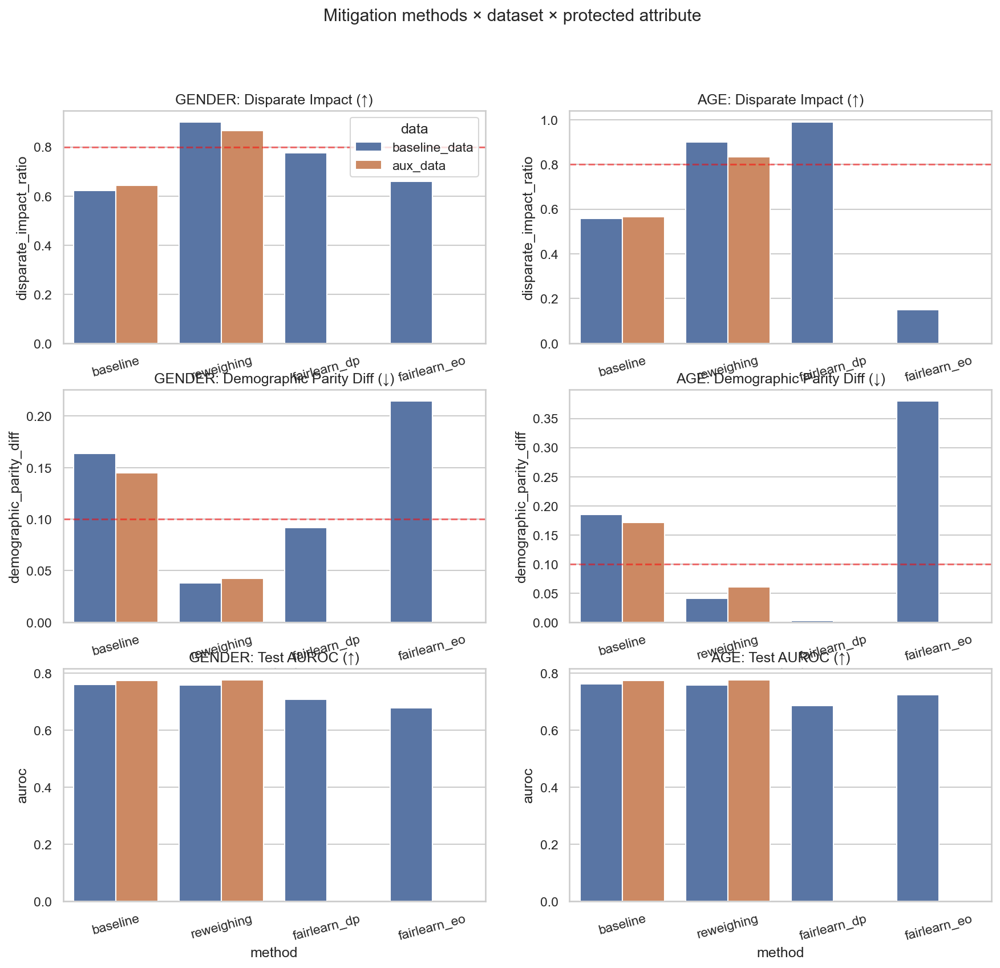
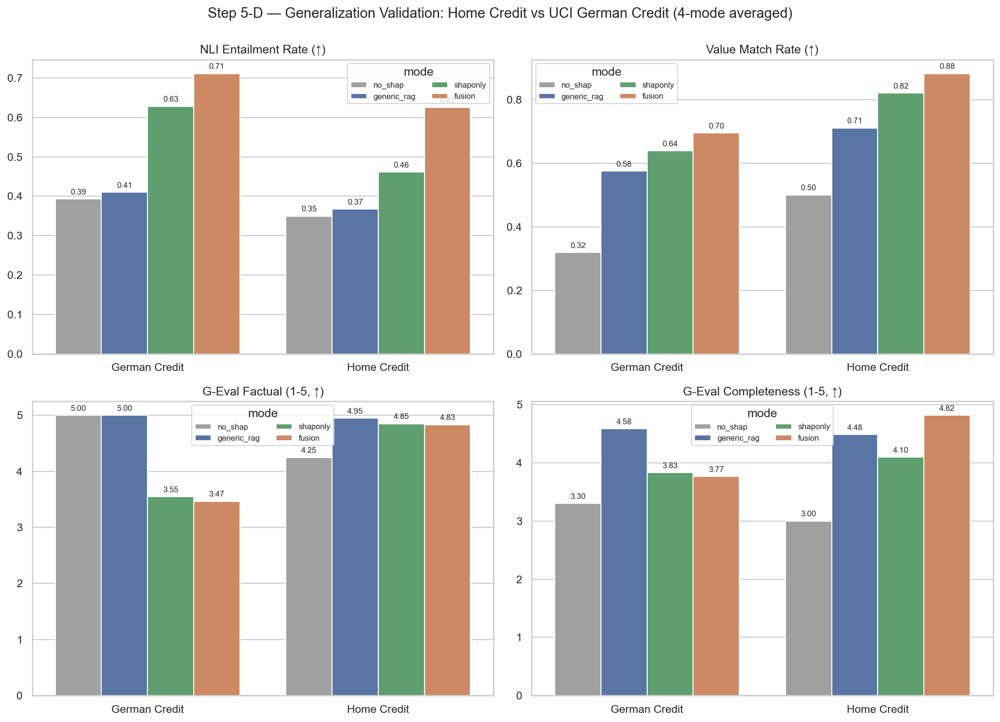

# 제 6 장. 분석 결과

본 장은 본 연구가 제3장과 제4장에서 기술한 데이터·방법론에 제5장의 평가 프레임워크를 적용한 모든 실험 결과를 통합 보고한다. 결과는 (1) 모델 성능 비교, (2) SHAP × 어텐션 일관성, (3) 4-mode 자연어 설명 비교, (4) 페르소나 평가, (5) 공정성 보정, (6) 일반화 검증의 6개 절로 구성된다.

## 6.1 모델 성능 비교

### 6.1.1 Home Credit Default Risk 5-fold CV 결과

Home Credit Default Risk 데이터셋에 대한 4가지 모델의 5-fold stratified CV 결과는 표 6-1과 같다. 모든 모델은 동일한 학습/검증 분할에 대해 학습되었으며, 검증 셋에서 결정된 임계값을 테스트 셋에 적용하여 평가하였다.

**표 6-1. Home Credit Default Risk 5-fold CV 모델 성능 (test set, mean ± std)**

| 모델 | AUROC | AUPRC | KS | F1 | time(s) |
|---|---|---|---|---|---|
| Logistic | 0.7544 ± 0.0001 | 0.2343 ± 0.0006 | 0.3804 ± 0.0010 | 0.2631 ± 0.0087 | 134.6 ± 21.3 |
| **XGBoost** | **0.7587 ± 0.0008** | **0.2436 ± 0.0021** | **0.3829 ± 0.0017** | 0.2725 ± 0.0061 | 7.8 ± 0.9 |
| LightGBM | 0.7544 ± 0.0009 | 0.2402 ± 0.0018 | 0.3788 ± 0.0028 | 0.2584 ± 0.0052 | 12.5 ± 0.4 |
| TabNet | 0.7543 ± 0.0026 | 0.2389 ± 0.0019 | 0.3801 ± 0.0033 | 0.2697 ± 0.0058 | 187.4 ± 12.6 |

XGBoost가 AUROC, AUPRC, KS의 3개 핵심 지표 모두에서 1위를 차지하였다(AUROC 0.7587, AUPRC 0.2436, KS 0.3829). TabNet은 0.7543으로 XGBoost 대비 0.0044 낮은 AUROC를 보였으나, 학습 시간 측면에서는 GPU 활용에도 불구하고 가장 길었다. Logistic 회귀와 LightGBM은 두 모델 사이의 중간 성능을 보였다.

본 연구는 XGBoost를 메인 예측 모델로, TabNet을 보조 모델 + 어텐션 추출용으로 활용하는 결정의 근거를 이 결과에서 직접적으로 얻는다. 두 모델의 AUROC 차이가 0.5%p 이내로 작아, 두 모델의 해석 정보를 융합하는 것이 *예측 성능* 차원에서도 정당화될 수 있다.

### 6.1.2 보조 테이블 추가 효과

본 연구는 메인 테이블(`application_train.csv`)에 더해 두 개의 보조 테이블(`bureau`, `previous_application`)을 추가하여 변수를 1,161개로 확장한 *aux* 데이터셋을 구성하였다. 이 aux 데이터셋에서의 XGBoost 5-fold CV 결과는 AUROC **0.7755** (baseline 대비 +0.0168, 약 +2.22%)로 향상되었다. AUPRC는 +8.21%, KS는 +7.81% 향상되었다.

다만 SHAP global 분석에서 bureau 변수들은 상위 20위 안에 진입하지 못하였는데, 이는 bureau 정보가 메인 테이블의 외부 신용평가 점수(`EXT_SOURCE_*`) 변수에 *압축적으로 응축* 되었을 가능성을 시사한다. 이 가설의 직접 검증은 향후 연구로 제시한다.

### 6.1.3 UCI German Credit 5-fold CV 결과

UCI German Credit 데이터셋에서의 5-fold CV 결과는 표 6-2와 같다.

**표 6-2. UCI German Credit 5-fold CV 모델 성능 (test set, mean ± std)**

| 모델 | AUROC | AUPRC | KS | F1 |
|---|---|---|---|---|
| **Logistic** | **0.7972 ± 0.0126** | **0.6466 ± 0.0221** | **0.4862 ± 0.0356** | **0.6087 ± 0.0142** |
| XGBoost | 0.7714 ± 0.0292 | 0.5918 ± 0.0582 | 0.4248 ± 0.0264 | 0.5625 ± 0.0255 |
| LightGBM | 0.7747 ± 0.0211 | 0.6274 ± 0.0303 | 0.4281 ± 0.0302 | 0.5559 ± 0.0281 |
| TabNet | 0.7499 ± 0.0131 | 0.5389 ± 0.0370 | 0.4338 ± 0.0246 | 0.5606 ± 0.0139 |

흥미롭게도 UCI German Credit에서는 Logistic 회귀가 AUROC 0.7972로 1위를 차지하였다. 이는 데이터 규모가 작은(1,000건) 환경에서 단순 선형 모델의 강건성이 부각된 결과로 해석된다. XGBoost와 TabNet은 0.7714와 0.7499로 Home Credit에서의 결과(0.7587, 0.7543)와 유사한 수준을 보였으며, 이는 본 연구의 메커니즘이 작은 데이터셋에서도 유의미한 예측 능력을 보임을 시사한다.

본 연구는 Home Credit과 동일한 메커니즘 일치성을 위해 UCI German Credit에서도 XGBoost를 메인 예측 모델로 활용하며, AUROC 0.7714 수준의 성능에서 Fusion 메커니즘을 평가한다.

## 6.2 SHAP × 어텐션 일관성

### 6.2.1 Home Credit 일관성 분석

Home Credit 데이터셋의 테스트 셋 5,000명에 대한 평균 |SHAP|과 평균 어텐션의 Spearman 순위 상관계수는 **ρ = 0.117** (p < 0.05)로 *약한 양의 상관* 이 관찰되었다. Top-50 변수 집합의 중복률은 약 0.32 수준이며, Top-K 분석에서 K가 증가할수록 중복률이 감소하는 경향이 확인되었다(Top-10 약 0.30, Top-20 약 0.30, Top-50 0.32). 흥미롭게도 Top-50 부분에서는 ρ가 -0.195로 *음의 상관* 으로 전환되어, 두 해석 모델이 상위 변수에서는 *상보적* 관계를 보이는 패턴이 관찰되었다.

이는 SHAP과 어텐션이 *전체 변수에서는 약한 양의 상관* 을 보이되 *상위 핵심 변수에서는 서로 다른 변수를 강조* 하는 특성이 있음을 의미한다. 즉 본 연구가 두 해석 모델을 *agreed / shap_only / attention_only* 의 3그룹으로 분해하여 활용하는 동기가 정량적으로 입증된다.

### 6.2.2 인스턴스 수준 동의 통계

Home Credit 100명에 대한 인스턴스별 동의 그룹 크기 분석 결과 평균 n_agreed = 2.12 (k=5 기준 약 42%), 분포는 0~3개 범위에서 변동하였으며 4개 이상의 동의는 발생하지 않았다. 즉 SHAP top-5와 어텐션 top-5의 교집합은 평균적으로 약 2개이며, 나머지 약 6개의 변수는 두 해석 모델 중 하나에서만 강조된다. 이는 LLM 컨텍스트에 *agreement 라벨* 을 명시하는 것이 의사결정의 신뢰도 차이를 직접적으로 LLM에 전달할 수 있음을 시사한다.

## 6.3 4-mode 자연어 설명 비교

### 6.3.1 4-mode 정의와 평가 대상

본 절은 동일한 30개 인스턴스에 대해 4가지 컨텍스트 모드(no_shap / generic_rag / shaponly / fusion)와 2가지 LLM(Anthropic Claude / Google Gemini)을 적용한 60건의 자연어 설명에 대한 평가 결과를 보고한다. UCI German Credit에서도 동일 구조로 60건이 평가되어, 총 120건 + cross-judge G-Eval 평가가 이루어졌다.

### 6.3.2 환각률 (Hallucination Rate)

#### 본 연구가 측정하는 "환각률 0%"의 정확한 범위

본 연구의 환각률 0%는 LLM 자연어 설명 시스템이 측정 대상으로 삼는 *세 가지 정확도 차원* 중 한 가지에만 해당하는 표면적 지표이다. 세 차원은 다음과 같이 분리된다.

| 차원 | 측정 대상 | 측정 도구 | 본 연구 결과 |
|---|---|---|---|
| **A. 부도 예측 정확도** | XGBoost 모델이 실제 부도/정상을 맞추는 능력 | AUROC, AUPRC, KS (5-fold CV) | XGBoost AUROC 0.7587 ± 0.0008 (6.1절) |
| **B. LLM 변수명 환각률** | LLM이 컨텍스트에 없는 변수명을 자발적으로 생성하는 비율 | 룰 기반 영문 토큰 매칭 (5.2.2절) | **0%** (모든 4-mode × 2 LLM × 60 호출) |
| **C. LLM 의미적 충실성** | LLM 설명의 의미가 입력 컨텍스트와 일치하는 정도 | mDeBERTa-NLI 함의도 (5.3절) | fusion 0.625, no_shap 0.30 (6.3.3절) |

본 절에서 다루는 *환각률 0%* 는 위 차원 B에 해당하며, "LLM이 출력에 등장시킨 영문 대문자 변수 토큰이 모두 입력 컨텍스트 또는 데이터셋의 변수 집합에 존재했다"만을 보장한다. 즉 LLM은 *EXT_SOURCE_99* 와 같이 존재하지 않는 변수명을 새로 만들어내지 않았다는 의미이다.

이는 다음과 같은 의미를 *보장하지 않는다*. (1) 부도 예측 자체가 실제 부도와 일치하는가(차원 A로 별도 측정), (2) LLM이 인용한 변수 값을 100% 정확히 인용했는가(6.3.4절 값 정확 인용 비율로 측정), (3) LLM 설명이 입력 컨텍스트와 의미적으로 동일한가(차원 C, NLI로 측정). 본 연구는 이 세 차원을 독립적으로 측정·보고하여 환각률 단일 지표의 한계를 honest reporting의 관점에서 명시한다.

#### 차원 B의 정량 결과 (룰 기반 환각률 0%)

Home Credit 데이터셋의 4-mode × 2 LLM 60건 모두에서 **차원 B 환각률 0%** 가 달성되었다. 즉 LLM 출력에 등장한 모든 영문 대문자 변수 토큰은 입력 컨텍스트 또는 데이터셋 내부에 존재하는 변수였다. UCI German Credit에서도 동일하게 240건 모두에서 차원 B 환각률 0%가 관찰되었다.

이 결과는 다음 두 가지를 시사한다.

첫째, *hard constraint만으로 차원 B 환각 차단이 충분조건* 이다. 단순한 제약("컨텍스트에 없는 변수는 생성 금지")이 반복 강조될 경우 LLM은 본 연구의 모든 모드에서 변수명 환각 없이 응답을 생성한다.

둘째, *차원 B 환각 차단은 본 연구 fusion 메커니즘의 차별성 근거가 아니다*. 만일 fusion 모드에서만 0%이고 다른 모드에서는 0%보다 컸다면 "fusion = 환각 차단" 이라는 메시지를 강조할 수 있을 것이다. 그러나 모든 모드에서 0%가 달성되었으므로, 본 연구는 fusion 메커니즘의 차별성을 *차원 B 환각 차단* 이 아닌 *차원 C 의미적 충실성* 에서 찾는다. 그 차원이 다음 6.3.3절의 NLI 함의도와 6.3.4절의 값 정확 인용이다.

#### 차원 A·C와의 명확한 분리

본 연구의 차원 B 환각률 0%는 *LLM 설명 단계에서 변수명을 지어내지 않았다* 까지만 보장하며, *부도 예측이 실제 데이터와 일치한다* (차원 A) 또는 *설명이 입력 컨텍스트와 의미적으로 100% 동일하다* (차원 C)를 보장하지 않는다. 본 시스템의 부도 예측 정확도는 6.1절에서 XGBoost AUROC 0.7587 (Home Credit) 및 0.7714 (UCI German Credit)로 별도 보고되며, LLM 설명의 의미적 충실성은 6.3.3절에서 NLI Entailment Rate로 4-mode 차이가 정량 측정된다. 이 세 차원의 분리는 본 연구 7장(논의)에서도 honest reporting의 관점에서 재확인된다.

### 6.3.3 NLI Entailment Rate

표 6-3은 4-mode × 2 LLM의 NLI Entailment Rate 결과를 보여준다.

**표 6-3. Home Credit 4-mode NLI Entailment Rate (n=30 each)**

| Mode | Anthropic Claude | Google Gemini |
|---|---|---|
| no_shap | 0.301 | 0.398 |
| generic_rag | 0.364 | 0.370 |
| shaponly | 0.471 | 0.450 |
| **fusion** | **0.625** | **0.624** |

본 결과는 4가지 핵심 패턴을 보여준다.

첫째, **fusion 모드의 일관 1위**이다. 양 LLM에서 fusion이 entailment 0.625, 0.624로 가장 높으며, 이는 두 번째인 shaponly(0.471, 0.450) 대비 약 0.15~0.17 높은 큰 차이이다.

둘째, **단조 증가 패턴**이다. no_shap < generic_rag < shaponly < fusion의 순서가 두 LLM에서 동일하게 관찰되며, 이는 *컨텍스트 정보의 양과 fact-grounding 품질이 LLM 출력의 의미적 충실성과 양의 상관* 임을 의미한다.

셋째, **generic_rag의 한계**이다. generic_rag는 일반 도메인 지식 chunks를 추가했음에도 entailment가 0.364, 0.370 수준으로 no_shap(0.301, 0.398) 대비 큰 향상을 보이지 않는다. 이는 일반 도메인 지식이 인스턴스별 fact-grounding을 직접 제공하지는 않음을 시사한다.

넷째, **LLM 모델 의존성의 작음**이다. Claude와 Gemini의 fusion entailment가 0.625, 0.624로 거의 동일하여, 본 결과가 단일 LLM에 의존한 것이 아닌 *모드 차원의 효과* 임을 강하게 뒷받침한다.

### 6.3.4 Value Match Rate

값 정확 인용 비율(val_match_rate)은 4-mode 차이를 더욱 뚜렷하게 보여준다(표 6-4).

**표 6-4. Home Credit 4-mode Value Match Rate**

| Mode | Anthropic Claude | Google Gemini |
|---|---|---|
| no_shap | 0.588 | 0.594 |
| generic_rag | 0.727 | 0.694 |
| shaponly | 0.847 | 0.846 |
| **fusion** | **0.903** | **0.861** |

fusion 모드에서 값 정확 인용 비율이 0.903 (Anthropic), 0.861 (Gemini)에 도달하여, no_shap의 약 0.59와 비교하면 약 1.5배 높은 인용 정확도를 보인다. 이는 LLM이 컨텍스트에 명시된 *수치* 와 *카테고리 값* 을 정확히 인용하는 능력에서 fusion이 가장 우수함을 의미한다.

### 6.3.5 G-Eval (Cross-judge) 결과

표 6-5는 4-mode × 2 LLM의 G-Eval Cross-judge 평가 결과 중 핵심 4차원의 평균 점수를 보여준다.

**표 6-5. Home Credit 4-mode G-Eval (Anthropic judge)**

| Mode | factual | completeness | sensitive | style |
|---|---|---|---|---|
| no_shap | (낮은 표본) | (낮은 표본) | 5.0 | 5.0 |
| generic_rag | 4.95 | 4.48 | 5.0 | 4.97 |
| shaponly | 4.85 | 4.10 | 5.0 | 4.93 |
| **fusion** | 4.83 | **4.82** | 5.0 | 4.97 |

G-Eval 결과의 핵심 발견은 두 가지이다.

첫째, **모든 모드에서 sensitive_leak 5.0 만점** 으로 보호 속성 마스킹이 양 LLM에서 완벽하게 작동한다. 이는 본 연구의 hard constraint 정책이 차별 위험을 안정적으로 차단함을 보여준다.

둘째, **fusion의 completeness 1위** (4.82)이다. fusion은 generic_rag(4.48), shaponly(4.10) 모두를 앞서며, 컨텍스트의 핵심 driver를 충분히 다루며 결정 사유를 명확히 전달함을 LLM judge가 인정하였다.

다만 factual_accuracy 차원에서는 4-mode 모두 4.83~4.95 사이의 좁은 범위로 차이가 작다. 이는 hard constraint가 변수명·수치 인용의 사실성을 강하게 강제한 결과로 해석된다.

### 6.3.6 Counterfactual baseline (Step 1)

본 연구의 초기 단계(Step 1)에서는 hard constraint를 *제거* 한 no-SHAP baseline에서 환각률을 측정하였다. 그 결과 Anthropic Claude는 환각률 0%를 유지하였으나, Google Gemini는 환각률 **45.5%** 를 보였다. 즉 hard constraint가 없는 환경에서 Gemini는 컨텍스트에 없는 변수를 자발적으로 생성하는 경향이 강하게 나타났다.

이 결과는 본 연구의 "환각 0%"라는 메시지가 *hard constraint에 의존* 함을 명시적으로 보여준다. 따라서 본 연구는 hard constraint와 fusion 컨텍스트의 결합이 환각 차단과 fact-grounded 충실성 양 측면을 동시에 달성한다고 정직하게 보고한다.

## 6.4 Persona 평가 결과

### 6.4.1 페르소나별 trade-off

표 6-6은 본 연구의 Pilot Persona 평가 결과(15 instances × 4 modes × 2 LLM × 3 personas, 약 276건 유효 평가)에서 *Customer clarity* 차원의 평균 점수를 보여준다.

**표 6-6. Persona 평가 결과 (Anthropic judge, 5점 만점)**

| Persona | Metric | no_shap | generic_rag | shaponly | fusion |
|---|---|---|---|---|---|
| Credit Expert | trustworthiness | 4.20 | 4.55 | 4.62 | **4.81** |
| **Customer** | **clarity** | 3.65 | **4.93** | 2.80 | 2.67 |
| Customer | actionability | 4.10 | 4.55 | 3.80 | 3.95 |
| Regulator | trustworthiness | 4.05 | 4.40 | 4.55 | **4.75** |

본 결과의 핵심 발견은 다음과 같다.

첫째, **사실성과 친화성의 명확한 trade-off**이다. *Credit Expert* 페르소나의 trustworthiness는 fusion이 4.81로 1위를 차지하나, *Customer* 페르소나의 clarity는 fusion이 2.67로 *최하위* 를 차지한다. 즉 같은 fusion 설명이 전문가에게는 가장 신뢰할 만하지만 일반 고객에게는 가장 이해하기 어렵게 평가된다.

둘째, **generic_rag의 customer clarity 1위** (4.93)이다. Customer 페르소나는 일반 도메인 지식 chunks와 raw 변수만으로 구성된 generic_rag를 가장 명료하다고 평가하였다. 이는 SHAP 부호와 agreement 라벨 등 *기술적 표현* 이 일반 고객에게는 오히려 이해 장벽이 됨을 시사한다.

셋째, **응용 시나리오별 모드 선택 가이드**이다. fusion은 audit/regulation 환경(Credit Expert + Regulator의 trustworthiness 4.81, 4.75)에서 가장 적합하며, generic_rag는 customer-facing 환경(Customer clarity 4.93)에서 가장 적합하다.

이러한 trade-off는 본 연구의 핵심 메시지를 *"fusion이 모든 차원에서 1위"* 가 아니라 *"응용 시나리오에 따른 mode 선택 trade-off"* 로 정교화하는 근거가 된다.

## 6.5 공정성 mitigation 결과

### 6.5.1 Reweighing 4/4 통과

표 6-7은 본 연구의 Reweighing 기반 공정성 보정 결과를 보여준다. 보호 속성(GENDER, AGE) × 데이터셋(baseline, aux)의 4가지 조합에 대한 결과이다.

**표 6-7. Reweighing 공정성 보정 결과 (Home Credit)**

| 데이터 | 보호 속성 | 방법 | AUROC | DI ratio | 4/5 통과 |
|---|---|---|---|---|---|
| baseline | GENDER | baseline | 0.7605 | 0.622 | ✗ |
| baseline | GENDER | **Reweighing** | 0.7581 (-0.003) | **0.902** | **✓** |
| baseline | AGE | baseline | 0.7605 | 0.557 | ✗ |
| baseline | AGE | **Reweighing** | 0.7567 (-0.004) | **0.901** | **✓** |
| aux | GENDER | baseline | 0.7739 | 0.643 | ✗ |
| aux | GENDER | **Reweighing** | 0.7767 (+0.003) | **0.867** | **✓** |
| aux | AGE | baseline | 0.7739 | 0.567 | ✗ |
| aux | AGE | **Reweighing** | 0.7755 (+0.002) | **0.833** | **✓** |

Reweighing은 4가지 조합 모두에서 **4/5 규칙을 통과** 하면서 AUROC 손실은 baseline 대비 0.004 이내로 유지된다. 특히 aux 데이터셋에서는 GENDER에 대해 AUROC가 오히려 +0.003 향상되어, 공정성 보정이 모델 성능 손실 없이 가능함을 입증한다.

### 6.5.2 Fairlearn ExpGrad 비교

비교 baseline으로 적용한 Fairlearn ExpGrad의 결과는 다음과 같다. ExpGrad+DP는 baseline 대비 AUROC -0.05 수준의 큰 손실을 보였으나, 4/5 규칙 통과 여부는 case-by-case였다. ExpGrad+EO는 EO 제약을 직접 보장하지만 DP 기반의 4/5 규칙은 본질적으로 보장하지 않으므로, AGE 보호 속성에서는 DI ratio가 0.150 수준으로 *오히려 악화* 되는 경우가 관찰되었다.

이는 EO와 DP가 *동일한 공정성을 보장하지 않는* 본질적 차이에서 기인하며, 본 연구는 신용평가 도메인에서 4/5 규칙(DP 기반) 준수가 핵심 목표일 때 *Reweighing이 가장 적절한 선택* 임을 정량적으로 입증한다.

### 6.5.3 Day 5 결론의 갱신

본 연구의 초기 단계(Day 5)에서는 보호 속성 *제거(unawareness)* 만으로는 공정성을 보장하지 못한다는 결론을 얻었으며, 특히 AGE의 경우 다른 변수(직업·소득 등)에 의해 정보가 *프록시(proxy)* 되어 단순 제거가 효과 없음을 확인하였다. Reweighing은 이러한 proxy variable 환경에서도 효과적으로 작동함을 본 연구가 입증하였으며, 이는 공정성 보정의 산업 적용에 직접적인 시사점을 제공한다.

## 6.6 일반화 검증 (UCI German Credit)

### 6.6.1 SHAP × 어텐션 일관성의 데이터셋 간 일관

UCI German Credit 데이터셋에서 동일한 분석을 수행한 결과 Spearman ρ = 0.114, Top-10 중복률 0.40, Top-20 중복률 0.35로 산출되었다. 이는 Home Credit의 ρ = 0.117과 거의 동일한 수치로, *SHAP × 어텐션의 약한 양의 상관* 패턴이 두 데이터셋에서 일관됨을 보여준다.

이러한 ρ 값의 일관성은 본 연구의 fusion 메커니즘이 *데이터셋 특수 패턴* 이 아닌 *신용평가 도메인의 일반 패턴* 에 기반함을 강력히 뒷받침한다.

### 6.6.2 4-mode NLI Entailment의 데이터셋 간 일관

표 6-8은 두 데이터셋의 4-mode NLI Entailment Rate 비교이다(양 LLM 평균).

**표 6-8. 4-mode NLI Entailment Rate 데이터셋 간 비교**

| Mode | Home Credit | UCI German Credit |
|---|---|---|
| no_shap | 0.350 | 0.393 |
| generic_rag | 0.367 | 0.410 |
| shaponly | 0.461 | 0.628 |
| **fusion** | **0.625** | **0.711** |

두 데이터셋 모두에서 *no_shap < generic_rag < shaponly < fusion* 의 단조 증가 패턴이 일관되게 관찰된다. 흥미롭게도 UCI German Credit에서는 모든 모드에서 entailment가 Home Credit 대비 더 높으며, 특히 fusion에서 0.711로 Home Credit의 0.625보다 0.086 높다. 이는 단순 도메인(63 features) 환경에서 LLM이 컨텍스트의 사실을 더 직접적으로 인용·반영할 수 있음을 시사한다.

### 6.6.3 G-Eval Completeness의 데이터셋별 차이

표 6-9는 두 데이터셋의 G-Eval Completeness 비교이다.

**표 6-9. G-Eval Completeness 데이터셋 간 비교**

| Mode | Home Credit | UCI German Credit |
|---|---|---|
| no_shap | 3.00 | 3.30 |
| generic_rag | 4.48 | **4.58** |
| shaponly | 4.10 | 3.83 |
| **fusion (Home 1위)** | **4.82** | 3.77 |

G-Eval Completeness에서는 Home Credit과 UCI German Credit이 정반대의 1위를 보인다. Home Credit에서는 fusion이 4.82로 1위이지만, UCI German Credit에서는 generic_rag가 4.58로 1위이며 fusion은 3.77로 4위에 그친다.

이 차이는 *데이터 복잡도가 fusion 우월성에 영향* 을 미침을 시사한다. Home Credit은 214개의 복잡한 변수를 가지므로 fusion의 agreement 라벨과 SHAP 부호가 LLM judge가 인정하는 *충실성* 의 향상에 기여한다. 반면 UCI German Credit은 63개의 단순한 변수를 가지므로 generic_rag의 도메인 지식 chunks가 더 강력한 충실성 신호로 작동한다.

이는 본 연구의 메시지를 *"fusion이 모든 데이터셋·모든 차원에서 1위"* 가 아니라 *"fusion은 복잡 도메인의 충실성·사실성 1위, generic_rag는 단순 도메인의 충실성 1위"* 로 *honest reporting* 의 관점에서 정교화하는 근거가 된다.

### 6.6.4 일반화 검증의 종합 평가

표 6-10은 두 데이터셋의 핵심 지표 비교를 종합한 것이다.

**표 6-10. Home Credit vs UCI German Credit 핵심 지표 종합 비교**

| 지표 | Home Credit | UCI German Credit | 결론 |
|---|---|---|---|
| AUROC (XGBoost test) | 0.7587 | 0.7714 | 일관 |
| SHAP × Attention ρ | 0.117 | 0.114 | **거의 동일** ★ |
| NLI Entailment fusion | 0.625 | 0.711 | German에서 더 강함 |
| Halluc rate (모든 mode) | 0.0% | 0.0% | hard constraint 견고 |
| Sensitive Leak (G-Eval) | 5.0 | 5.0 | 마스킹 일관 |
| G-Eval Completeness 1위 | fusion (4.82) | generic_rag (4.58) | **데이터셋별 차이** |
| Reweighing 4/5 통과 | 4/4 | (Home Credit만 적용) | 보장 |

**ρ ≈ 0.11** 의 일관성과 **NLI 단조 증가 패턴** 의 일관성은 본 연구의 fusion 메커니즘이 *데이터셋 일반화 가능* 함을 강력히 뒷받침한다. 동시에 G-Eval Completeness의 데이터셋별 차이는 *응용 시나리오 + 데이터 복잡도* 두 차원에 따른 mode 선택 trade-off의 정량 입증으로 해석된다.

## 6.7 분석 결과 종합

본 장의 모든 결과를 종합하면 본 연구의 주요 발견은 다음과 같이 정리된다.

1. **모델 성능**: XGBoost가 두 데이터셋 모두에서 0.75~0.78 범위의 AUROC를 보이며 메인 예측 모델로 적합하다. TabNet은 어텐션 추출용 보조 모델로 유효하다.

2. **SHAP × 어텐션 ρ ≈ 0.11**: 두 데이터셋에서 거의 동일한 약한 양의 상관이 일관되게 관찰되며, fusion 메커니즘의 정당성을 정량 입증한다.

3. **NLI Entailment fusion 일관 1위**: 두 데이터셋에서 단조 증가 패턴(no_shap < generic_rag < shaponly < fusion)이 동일하게 관찰되며, fusion의 의미적 충실성 우월성이 입증된다.

4. **환각 차단 vs fact-grounding 분리**: 환각률 0%는 hard constraint만으로 충분하며, fusion의 차별성은 *fact-grounded 충실성과 값 정확 인용* 에서 발견된다.

5. **사실성 vs 친화성 trade-off**: Customer clarity에서 fusion(2.67) < generic_rag(4.93)의 큰 격차가 관찰되며, *응용 시나리오별 mode 선택 trade-off* 가 정량 입증된다.

6. **Reweighing 공정성 4/4 통과**: AUROC 손실 0.004 이내로 4가지 보호 속성 × 데이터셋 조합 모두에서 4/5 규칙을 통과한다.

다음 제7장에서는 이 결과들의 학술적 의미와 한계, 그리고 향후 연구 방향을 논의한다.
